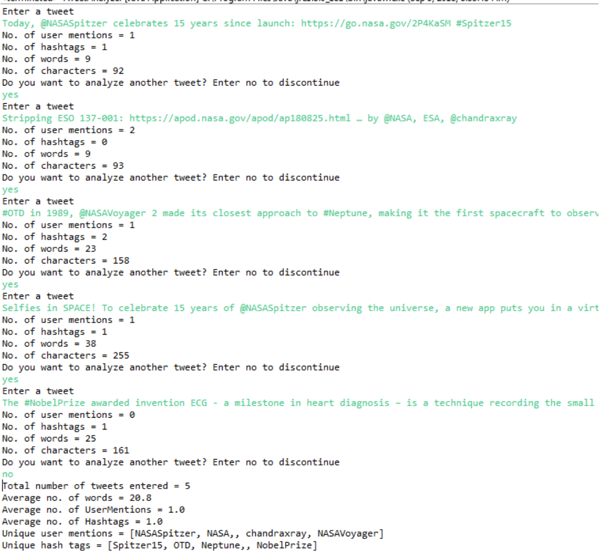

# Programming Assignment 1

## Problem Description

Write a Java program that does the following:

1. Write a loop that goes on till the user enters ‘no’ to the following question:
`Do you want to analyze another tweet?`
2. Ask the use to enter a tweet and store it in a String variable.
3. For each tweet find the following:
a. Number of user mentions (words starting with @)
b. Number of hash tags (words starting with #)
c. Total number of words
d. Total number of characters
4. Count the total number of tweets processed.
5. Find the average number of words, user mentions and hashtags in all the tweets processed.
6. Display the unique user mentions and hashtags.

## Submission Instructions:

1. Finish the program `TweetReader` with the instructions above
2. Commit your code to your repository

## Sample tweets to work with:

Here's all of the amazing women who have received the #NobelPrize and their remarkable
achievements at the time of the award.
 
 * \#OTD in 1989, @NASAVoyager 2 made its closest approach to #Neptune, making it the first
spacecraft to observe the planet up close: https://go.nasa.gov/2Hyo2vZ

* Today, @NASASpitzer celebrates 15 years since launch: https://go.nasa.gov/2P4KaSM
\#Spitzer15

* Stripping ESO 137-001: https://apod.nasa.gov/apod/ap180825.html … by @NASA, ESA,
@chandraxray

* Selfies in SPACE! To celebrate 15 years of @NASASpitzer observing the universe, a new app
puts you in a virtual spacesuit exploring gorgeous cosmic landscapes that you can learn more
about. Download on iOS & Android: https://go.nasa.gov/2PDofmx \#Spitzer15

* The #NobelPrize awarded invention ECG - a milestone in heart diagnosis – is a technique
recording the small electric waves being generated during heart activity.

## Sample Output

Please note that in the above, I didn’t remove the ‘,’ after the user mention or the hashtag.
To receive a 100% credit, please remove the commas. 

## Grading Rubic

|               |  5  |  4  |  3  |  2  |  1  |
|---------------|:---:|:---:|:---:|:---:|:---:|
| Coding Style  |     |     |     |     |     |
| Accuracy      |     |     |     |     |     |
| Comments      |     |     |     |     |     |
| Efficiency    |     |     |     |     |     |

## Overall Grade

| Letter Grade   |
|:--------------:|
|     -          |