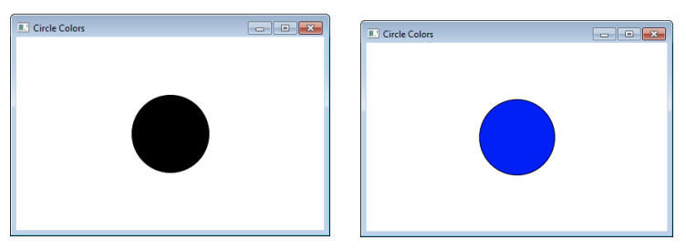
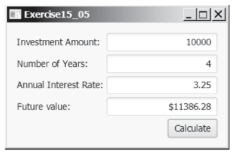

# Programming Assignment 7

## Problem Description

Finish the program `BlackAndBlueButton` to changes the color of a circle as black when the mouse button is pressed,
and as blue when the mouse button is released.

Finish the program `InvestmentCalculator` to calculate the future value of an investment at a given interest rate for a
specified number of years. The formula for the calculation is:

^{years*12})

Use text fields for the investment amount, number of years, and annual interest rate. Display the
future amount in a text field when the user clicks the Calculate button, as shown in Figure below.

[Think about the discussion in class we had about the Loan Calculator interface, and design your
UI for this problem accordingly]

## Submission Instructions:

1. Finish the assignment from the instructions above
2. Commit your code to your repository

## Total Points: 100

## Grading Rubic

|               |  5  |  4  |  3  |  2  |  1  | Points |
|---------------|:---:|:---:|:---:|:---:|:---:|:------:|
| Coding Style  |     |     |     |     |     |        |
| Accuracy      |     |     |     |     |     |        |
| Maintain      |     |     |     |     |     |        |
| Efficiency    |     |     |     |     |     |        |

## Overall Grade

| Letter Grade   | Points |
|:--------------:|:------:|
|     -          |   -    |