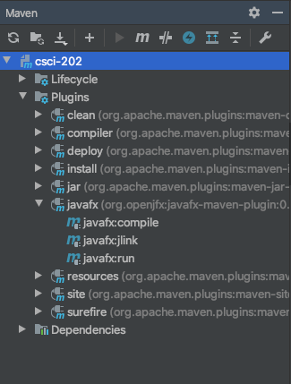

# JavaFx

In order to run JavaFx applications, you'll need to modify your `pom.xml` file to
specify the desired main class that you wish to run. The steps below will outline
how to accomplish this

## Running a JavaFx application with Maven

1.) Navigate to your `pom.xml` and find the `javafx-maven-plugin` plugin. It will
probably be at the bottom of the file and it looks something like

```xml
<plugin>
    <groupId>org.openjfx</groupId>
    <artifactId>javafx-maven-plugin</artifactId>
    <version>0.0.3</version>
    <configuration>
        <mainClass>edu.citadel.csci202.javafx.eventhandling.ex1.ButtonCounter</mainClass>
    </configuration>
</plugin>
```

2.) Modify the `mainClass` attribute to the full location of the JavaFx application
that you wish to run

3.) Navigate to the Maven execution options on the right-hand side of the IntelliJ
editor. It should look like the following



4.) You should see an option for `javafx:run`. Double click this option in order to
compile and execute a JavaFx application. You can also run from the command line by
using the command

```bash
./mvnw javafx:run
```

> If you don't see the option, click the refresh option in the Maven dialog in order
> to refresh your options

5.) Success! You can use this method for executing any of the JavaFx examples in
this repository.